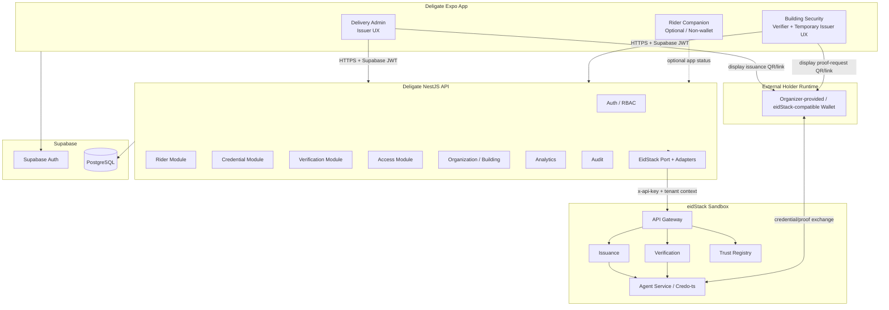
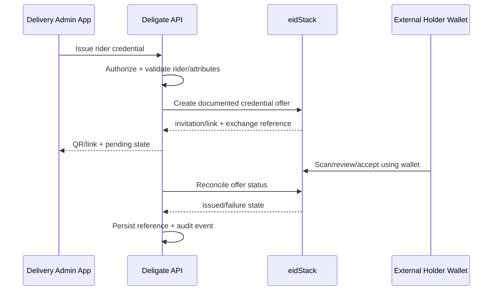
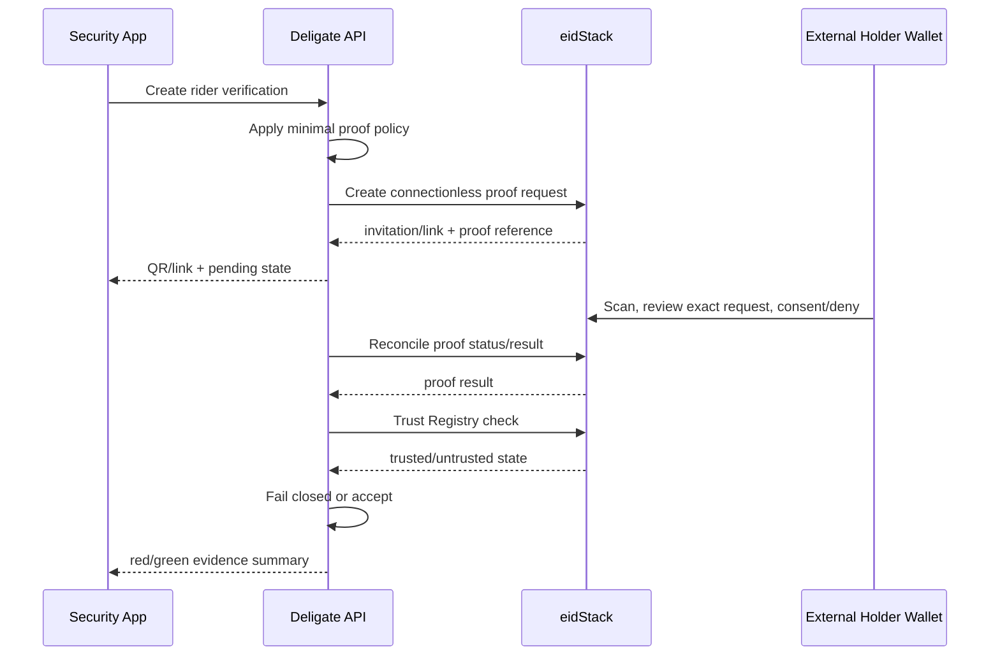
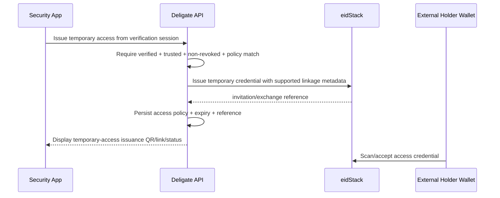

# ARCH.md — Deligate Architecture

## 1. System View



The holder wallet is an external dependency, not a Deligate feature module.

## 2. Trust Boundaries

### Deligate mobile boundary
Untrusted client. It can request actions but cannot decide authorization, credential validity, trust or access eligibility.

### External wallet boundary
Organizer-provided/eidStack-compatible holder runtime. It owns holder keys, credential storage, wallet unlock/backup, QR scanning, credential acceptance and proof-selection/consent. Deligate does not import or duplicate those responsibilities.

### Deligate API boundary
Trusted application backend. It validates the Supabase session, authorizes the actor, orchestrates business rules and owns all eidStack secrets.

### Supabase boundary
Stores application/business state, identities, references, audit events and access policy. It does not replace eidStack cryptographic verification.

### eidStack boundary
External SSI platform used for agents/tenants/DIDs, schema and credential-definition operations, credential issuance/revocation, proof verification and Trust Registry decisions.

## 3. Role Model

### Delivery Admin — Issuer
- manages operational rider profiles
- initiates `VerifiedRiderCredential` issuance
- displays eidStack-returned issuance QR/link
- views issuance state
- revokes rider credentials
- sees issuer dashboard/activity

### Rider — Holder
The rider's cryptographic holder experience occurs in the organizer-compatible external wallet:
- scans credential/proof invitations
- reviews offered/requested data
- accepts/declines credentials
- consents/denies proof sharing
- stores credentials and keys
- presents proofs

An optional Deligate Rider companion may show privacy-safe application status/history, but it is not a credential wallet and is not required for the core demo.

### Building Security — Verifier + Issuer
- creates minimal rider proof request
- displays eidStack-returned proof QR/link
- receives verification/trust/revocation result
- denies failed/untrusted/revoked checks
- issues a short-lived temporary building access credential after success

## 4. Core Data Flows

### A. Rider Credential Issuance



Deligate does not implement the wallet acceptance screen or holder key storage.

### B. Rider Verification



The external wallet owns the final holder consent UI. Deligate owns the proof policy it sends.

### C. Verify-Then-Issue Temporary Access



## 5. App Data vs SSI Data

| Concern | Supabase | eidStack / External Wallet |
|---|---|---|
| User login/session | Yes | No |
| Rider operational profile | Yes | No |
| Building/floor/elevator policy | Yes | No |
| App workflow session | Yes | Reference only |
| Credential exchange ID | Reference | Source |
| Proof record ID | Reference | Source |
| Credential cryptographic validity | No | eidStack |
| Credential revocation | Cached/reference only | eidStack |
| Trusted issuer/verifier state | Cached/reference only | eidStack |
| Holder private keys | Never | External wallet |
| Raw credential storage | Never by default | External wallet |
| Holder proof selection/consent | No | External wallet |
| Audit event | Yes | Optional external transaction data |

## 6. QR, Invitation and DIDComm Boundary

Deligate may render a QR code from the invitation/request value returned by eidStack. The QR is a visual entry point for the wallet.

DIDComm is not the QR generator. It is a secure messaging protocol used by applicable agent/wallet exchanges. OpenID4VCI/OpenID4VP are separate protocol families and must not be conflated with DIDComm.

No Deligate camera scanner is required for the core flow because the external holder wallet performs the scan.

## 7. Adapter Pattern

Application services depend on a narrow port:

```ts
interface EidStackPort {
  issueRiderCredential(input: IssueRiderInput): Promise<IssuanceResult>;
  revokeCredential(input: RevokeCredentialInput): Promise<RevocationResult>;
  createProofRequest(input: RiderProofInput): Promise<ProofRequestResult>;
  getProofStatus(input: ProofStatusInput): Promise<ProofStatusResult>;
  checkTrust(input: TrustCheckInput): Promise<TrustCheckResult>;
  issueTemporaryAccess(input: TemporaryAccessCredentialInput): Promise<IssuanceResult>;
}
```

Infrastructure implementations:
- `MockEidStackAdapter` — deterministic development only
- `LiveEidStackAdapter` — real server-side HTTPS integration

No application module should branch on raw endpoint details.

## 8. State Machines

### Credential application state
`DRAFT -> OFFER_CREATED -> AWAITING_SCAN -> ISSUED`

Failure/terminal states: `DECLINED`, `FAILED`, `REVOKED`.

### Verification state
`REQUEST_CREATED -> AWAITING_SCAN -> PRESENTATION_RECEIVED -> VERIFYING -> VERIFIED`

Other terminal states: `DENIED`, `DECLINED`, `FAILED`, `TIMED_OUT`.

### Access pass state
`PENDING -> ACTIVE -> EXPIRED`

Alternative terminal states: `DENIED`, `FAILED`, `REVOKED` if the final platform behavior exposes that concept for the temporary credential.

State names in the live adapter must be mapped from observed/documented eidStack behavior, not guessed.

## 9. Scope / Non-Goals

Core Deligate builds:
- Delivery Admin issuer workflow
- Building Security verifier workflow
- server-side verification/access policy
- QR/link rendering for external-wallet handoff
- audit/status/technical diagnostics

Core Deligate does **not** build:
- holder DID/private-key generation
- credential wallet storage
- wallet PIN/biometric/backup
- holder QR scanner
- holder credential acceptance UI
- holder proof-selection/consent UI
- a DIDComm agent implementation

## 10. Scaling Without Premature Complexity
- one Expo app for Deligate operational roles
- optional non-wallet Rider companion only if time/value justifies it
- one NestJS API
- one Supabase project
- one eidStack adapter boundary
- feature-local modules
- shared contracts only for stable cross-layer shapes
- no event bus/microservice split inside Deligate unless a concrete bottleneck appears

The architecture is intentionally modular without recreating eidStack's internal services or wallet runtime.
