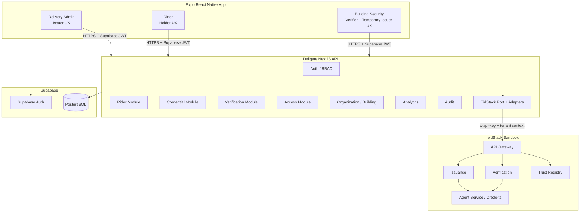
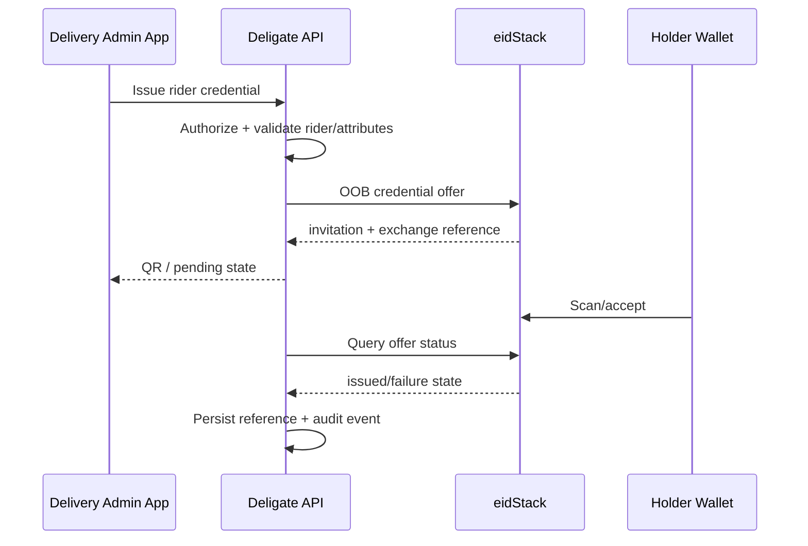
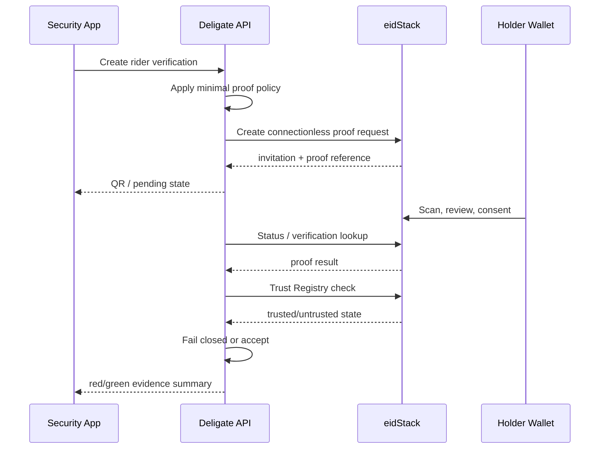
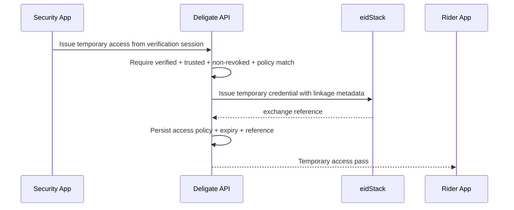

# ARCH.md — Deligate Architecture

## 1. System View



## 2. Trust Boundaries

### Mobile boundary

Untrusted client. It can request actions but cannot decide authorization, credential validity, trust or access eligibility.

### Deligate API boundary

Trusted application backend. It validates the Supabase session, authorizes the actor, orchestrates business rules and owns all eidStack secrets.

### Supabase boundary

Stores application/business state, identities, references, audit events and access policy. It does not replace eidStack cryptographic verification.

### eidStack boundary

External SSI platform used for agents/tenants/DIDs, schema and credential-definition operations, credential issuance/revocation, proof verification and Trust Registry decisions.

## 3. Role Model

### Delivery Admin — Issuer

- manages operational rider profiles
- issues `VerifiedRiderCredential`
- views issuance state
- revokes rider credentials
- sees issuer dashboard/activity

### Rider — Holder

- sees rider credential/app status
- scans credential/proof invitations
- reviews offered/requested data
- consents or denies
- sees proof/access history
- sees temporary access pass

The actual cryptographic holder runtime on hackathon day may be the organizer-compatible eidStack wallet rather than a home-grown wallet embedded in Expo. Deligate must not fake live wallet cryptography.

### Building Security — Verifier + Issuer

- creates rider proof request
- displays QR invitation
- receives verified/trust/revocation result
- denies failed/untrusted/revoked checks
- issues a short-lived temporary building access credential after success

## 4. Core Data Flows

### A. Rider Credential Issuance



### B. Rider Verification



### C. Verify-Then-Issue Temporary Access



## 5. App Data vs SSI Data

| Concern                           | Supabase              | eidStack                           |
| --------------------------------- | --------------------- | ---------------------------------- |
| User login/session                | Yes                   | No                                 |
| Rider operational profile         | Yes                   | No                                 |
| Building/floor/elevator policy    | Yes                   | No                                 |
| App workflow session              | Yes                   | Reference only                     |
| Credential exchange ID            | Reference             | Source                             |
| Proof record ID                   | Reference             | Source                             |
| Credential cryptographic validity | No                    | Yes                                |
| Credential revocation             | Cached/reference only | Yes                                |
| Trusted issuer/verifier state     | Cached/reference only | Yes                                |
| Audit event                       | Yes                   | Optional external transaction data |

## 6. Adapter Pattern

Application services depend on a narrow port:

```ts
interface EidStackPort {
  issueRiderCredential(input: IssueRiderInput): Promise<IssuanceResult>;
  revokeCredential(input: RevokeCredentialInput): Promise<RevocationResult>;
  createProofRequest(input: RiderProofInput): Promise<ProofRequestResult>;
  getProofStatus(input: ProofStatusInput): Promise<ProofStatusResult>;
  checkTrust(input: TrustCheckInput): Promise<TrustCheckResult>;
  issueTemporaryAccess(input: TemporaryAccessCredentialInput): Promise<IssuanceResult>;
}
```

Infrastructure implementations:

- `MockEidStackAdapter` — deterministic development only
- `LiveEidStackAdapter` — real server-side HTTPS integration

No application module should branch on raw endpoint details.

## 7. State Machines

### Credential application state

`DRAFT -> OFFER_CREATED -> AWAITING_SCAN -> ISSUED`

Failure/terminal states: `DECLINED`, `FAILED`, `REVOKED`.

### Verification state

`REQUEST_CREATED -> AWAITING_SCAN -> PRESENTATION_RECEIVED -> VERIFYING -> VERIFIED`

Other terminal states: `DENIED`, `DECLINED`, `FAILED`, `TIMED_OUT`.

### Access pass state

`PENDING -> ACTIVE -> EXPIRED`

Alternative terminal states: `DENIED`, `FAILED`, `REVOKED` if the final platform behavior exposes that concept for the temporary credential.

State names in live adapter must be mapped from observed/documented eidStack behavior, not guessed.

## 8. Scaling Without Premature Complexity

- one Expo app, role-aware navigation
- one NestJS API
- one Supabase project
- one eidStack adapter boundary
- feature-local modules
- shared contracts only for stable cross-layer shapes
- no event bus/microservice split inside Deligate unless a concrete bottleneck appears

The architecture is intentionally modular without recreating eidStack’s internal microservices.
